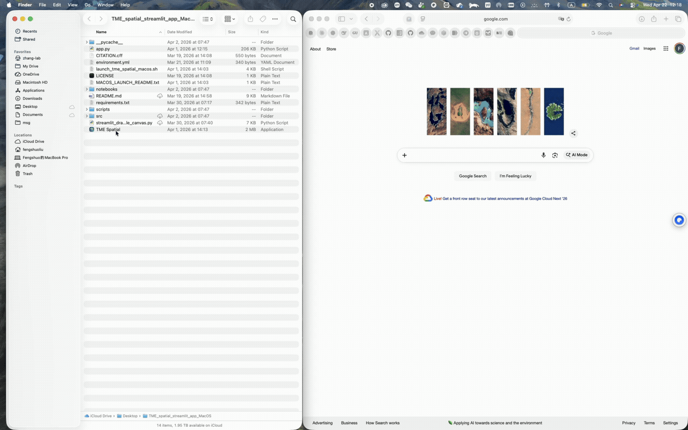
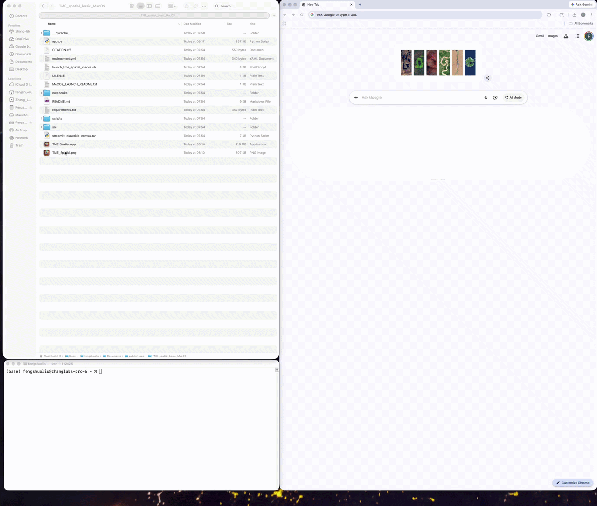
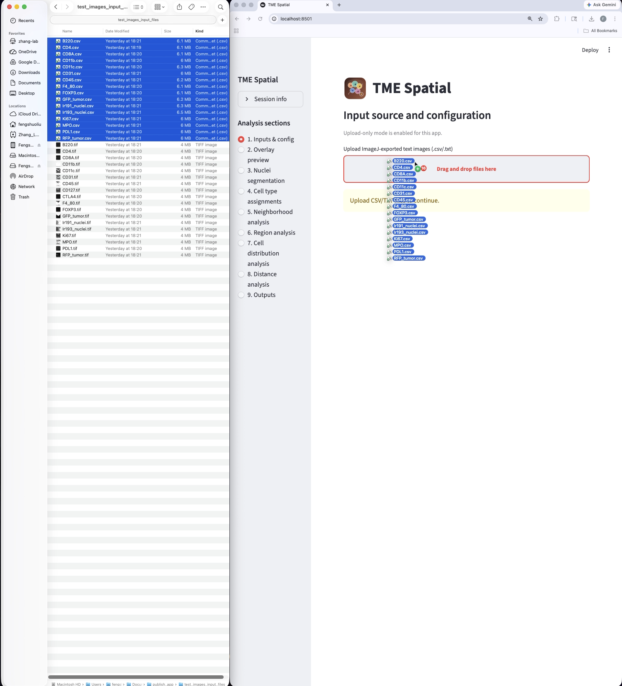
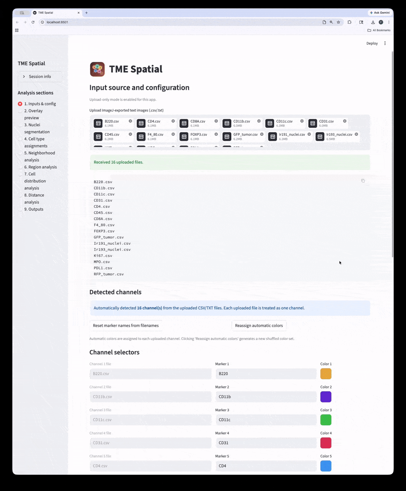
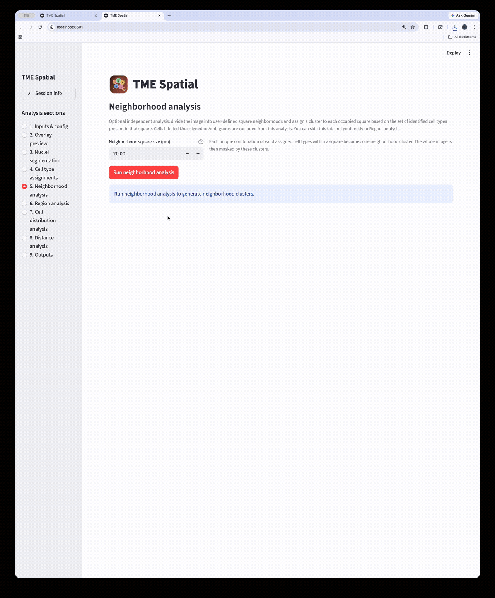
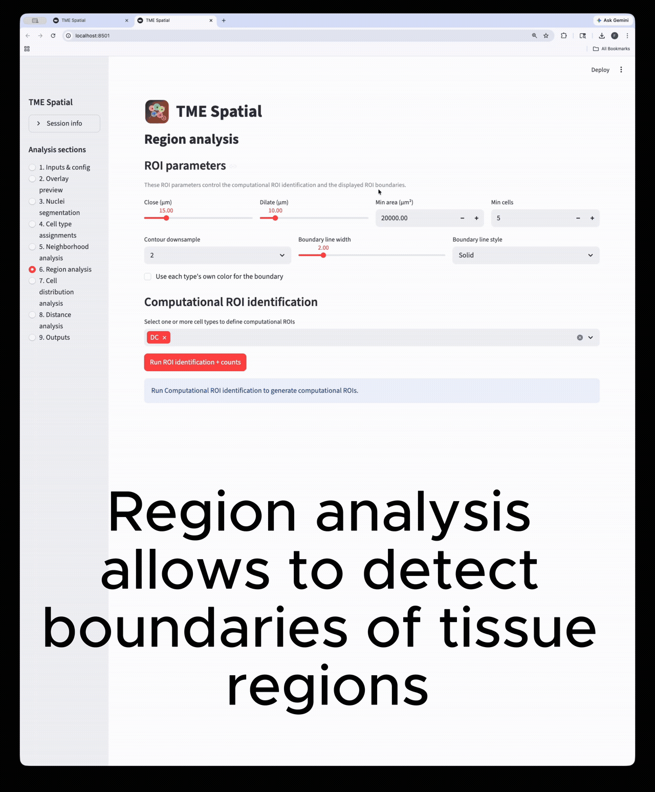
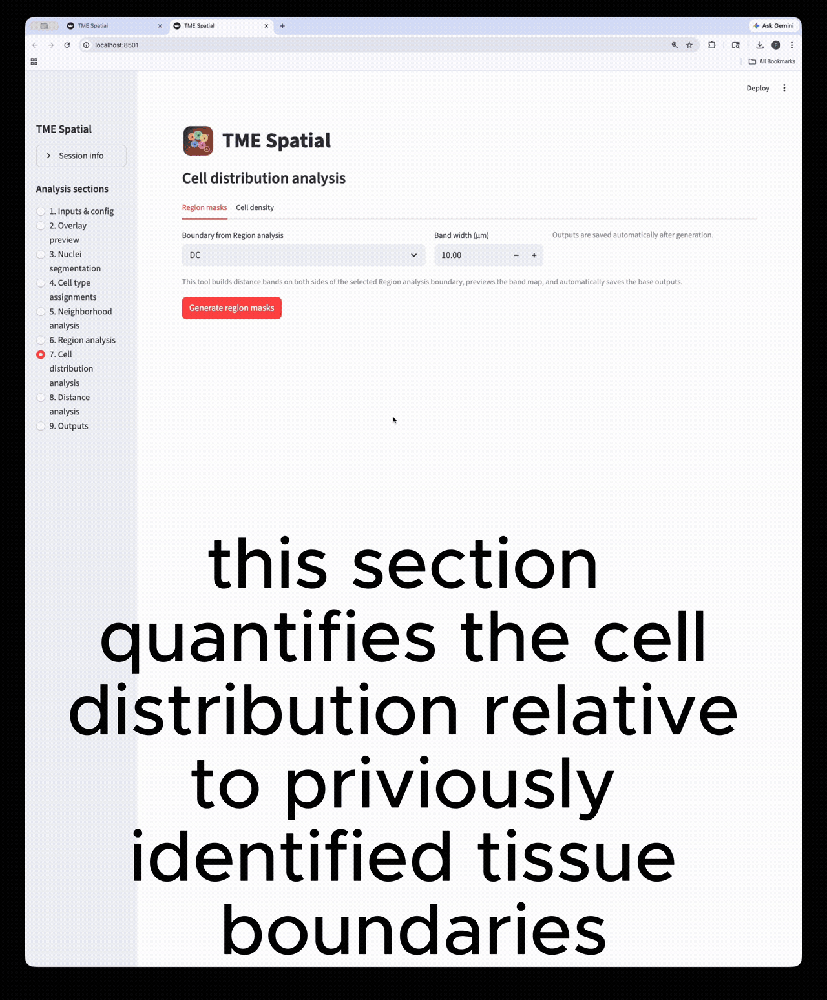
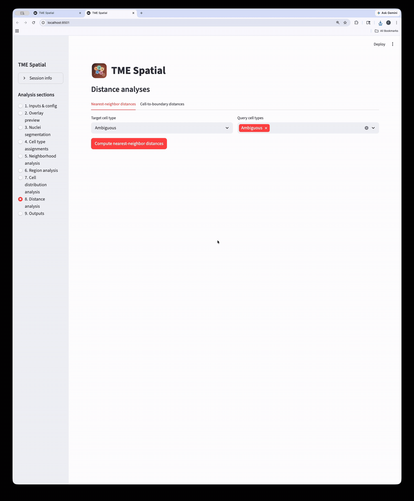
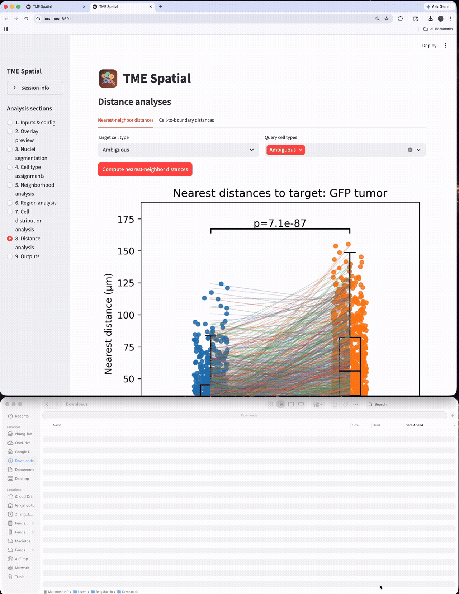

# TME Spatial

> [!IMPORTANT]
> **TME Spatial is preserved as the historical prototype associated with published work.**
> The actively maintained native application has been renamed **SpatialPlexomera** and is now available from the [SpatialPlexomera repository](https://github.com/fengshuoliu/SpatialPlexomera). This repository and its website will remain online so citations and existing links continue to resolve.

## Project website

[https://fengshuoliu.github.io/TME_spatial/](https://fengshuoliu.github.io/TME_spatial/)

TME Spatial is a Streamlit application for spatial image analysis from ImageJ-exported text images (`.csv` / `.txt`). The macOS and Windows packages now share the same analysis codebase; the only platform-specific differences are the installation and launch files.

The current app supports:

- upload-based multi-channel input configuration
- overlay and split-channel figure generation
- nuclei segmentation
- rule-based cell type definition and assignment
- neighborhood clustering
- ROI / region analysis
- cell distribution analysis
- nearest-neighbor and cell-to-boundary distance analysis
- downloadable per-step outputs organized into section folders

## Repository layout

```text
TME_spatial/
├── app.py
├── environment.yml
├── requirements.txt
├── launch_tme_spatial_macos.sh
├── TME Spatial.app
├── Launch_TME_Spatial.bat
├── launch_tme_spatial.ps1
├── Create_TME_Spatial_Shortcut.ps1
├── scripts/
│   └── check_env.py
├── src/
│   └── tme_spatial/
├── docs/
│   └── assets/
│       └── instruction-media/
└── notebooks/
```

## Installation

TME Spatial supports both a manual environment setup and a one-click launcher workflow.

| Method | macOS | Windows | Best for | Main files |
| --- | --- | --- | --- | --- |
| Manual install | `environment.yml` or `requirements.txt` | `requirements.txt` | Reproducible lab installs, development, troubleshooting | `environment.yml`, `requirements.txt`, `scripts/check_env.py` |
| One-click launcher | Double-click `TME Spatial.app` | Double-click `Launch_TME_Spatial.bat` | Fast local setup for end users | `TME Spatial.app`, `launch_tme_spatial_macos.sh`, `Launch_TME_Spatial.bat`, `launch_tme_spatial.ps1` |

### macOS manual installation

| Step | Command | Purpose |
| --- | --- | --- |
| 1 | `cd /path/to/TME_spatial` | Move into the repository root |
| 2 | `conda config --add channels conda-forge` | Use the package channel expected by `environment.yml` |
| 3 | `conda config --set channel_priority strict` | Keep scientific package resolution stable |
| 4 | `conda env create -f environment.yml` | Create the recommended macOS environment |
| 5 | `conda activate tme-spatial-app` | Activate the new environment |
| 6 | `python scripts/check_env.py` | Verify the scientific stack imports correctly |
| 7 | `python -m streamlit run app.py` | Start the app |

If you prefer `venv` instead of Conda:

```bash
python3.11 -m venv .venv
source .venv/bin/activate
python -m pip install --upgrade pip setuptools wheel
python -m pip install -r requirements.txt
python scripts/check_env.py
python -m streamlit run app.py
```

### macOS one-click installation



| Item | Behavior |
| --- | --- |
| `TME Spatial.app` | Opens Terminal and calls `launch_tme_spatial_macos.sh` from the repo root |
| Conda available | Reuses or creates the `TME_spatial` Conda environment |
| Conda unavailable | Creates a local virtual environment and installs dependencies there |
| Python missing | Tries Homebrew `python@3.11` first, otherwise shows a guided error dialog |
| Browser launch | Opens the Streamlit app in the default browser when the local server is ready |

Notes:

- Keep `TME Spatial.app`, `launch_tme_spatial_macos.sh`, `app.py`, and `requirements.txt` in the same folder.
- If Gatekeeper blocks the app, right-click `TME Spatial.app`, choose **Open**, then confirm.

### Windows manual installation


| Step | Command | Purpose |
| --- | --- | --- |
| 1 | `cd C:\path\to\TME_spatial` | Move into the repository root |
| 2 | `py -3.11 -m venv .venv` | Create a Windows virtual environment |
| 3 | `Set-ExecutionPolicy -Scope Process -ExecutionPolicy Bypass` | Allow activation for the current PowerShell session |
| 4 | `.\.venv\Scripts\Activate.ps1` | Activate the environment |
| 5 | `python -m pip install --upgrade pip setuptools wheel` | Update base packaging tools |
| 6 | `python -m pip install -r requirements.txt` | Install app dependencies |
| 7 | `python scripts/check_env.py` | Verify imports |
| 8 | `python -m streamlit run app.py` | Start the app |

### Windows one-click installation


| Item | Behavior |
| --- | --- |
| `Launch_TME_Spatial.bat` | Starts the PowerShell launcher `launch_tme_spatial.ps1` |
| Conda available | Reuses or creates the `TME_spatial` Conda environment |
| Conda unavailable | Uses Python directly and creates a local environment path when needed |
| Python missing | Tries `winget` first, then the official Python 3.11 installer |
| Optional icon shortcut | `Create_TME_Spatial_Shortcut.ps1` creates `Launch TME Spatial.lnk` using `TME_Spatial.ico` |
| Diagnostics | Writes `launcher_log.txt` if the PowerShell launcher runs into an error |

Notes:

- Keep `Launch_TME_Spatial.bat`, `launch_tme_spatial.ps1`, `app.py`, and `requirements.txt` in the same folder.
- The first launch can take a while because Python packages may need to be installed.

## Launch the app



| Item | What to expect |
| --- | --- |
| Local URL | The app usually opens at `http://localhost:8501` |
| Browser behavior | A browser tab is opened automatically when the launcher succeeds |
| Terminal / PowerShell window | Shows setup progress, package installation, and Streamlit logs |
| Repeat launches | Later launches are much faster because the environment is reused |

## Prepare input files



| Requirement | Details | Why it matters |
| --- | --- | --- |
| File type | `.csv` or `.txt` exported from ImageJ / Fiji as text images | The loader expects numeric intensity grids |
| File structure | One 2D rectangular intensity grid per file | Each uploaded file becomes one channel |
| Marker naming | Use stable, human-readable file names | Marker names are initialized from filenames |
| Calibration info | Know `x (µm)`, `x (px)`, `y (µm)`, `y (px)` | Pixel size is used by downstream spatial analyses |
| Spreadsheet editing | Avoid re-saving in Excel unless the grid stays intact | Spreadsheet tools can corrupt the rectangular pixel grid |

## 1. Inputs & config



Upload your ImageJ-exported channel files, confirm the automatically detected channels, assign marker names/colors, set the pixel-size calibration, and save the configuration.

| Parameter | Meaning | Practical note |
| --- | --- | --- |
| `Channel n file` | The uploaded file assigned to a channel slot | Each uploaded file is treated as one image channel |
| `Marker n` | Marker name used throughout the app | This name is reused in plots, tables, and cell type rules |
| `Color n` | Display color for that channel | Visualization only |
| `x (µm)` | Physical width used for calibration | Combined with `x (px)` to compute `PIXEL_SIZE_UM` in x |
| `x (px)` | Pixel width used for calibration | Must match the same measurement as `x (µm)` |
| `y (µm)` | Physical height used for calibration | Combined with `y (px)` to compute `PIXEL_SIZE_UM` in y |
| `y (px)` | Pixel height used for calibration | Must match the same measurement as `y (µm)` |
| `Overlay channels` | Channels included in the composite overlay | These settings are reused by Step 2 |
| `White overlay channel` | Optional channel drawn in white | Useful for structural context |
| `White overlay weight` | Strength of the white overlay contribution | Higher values make the white channel more dominant |

Main saved output:

- `outs/00_config/config.json`

## 2. Overlay preview


This section loads the uploaded numeric grids and creates the composite overlay plus split-channel figures.

| Parameter or dependency | Meaning | Practical note |
| --- | --- | --- |
| `Overlay channels` | Channels shown in the composite overlay | Set in Step 1 |
| `White overlay channel` | Optional channel added in white | Set in Step 1 |
| `White overlay weight` | Weight of the white channel | Set in Step 1 |
| `Load inputs and generate overlay` | Executes the figure-generation step | Use this to confirm marker-to-file assignments and overall signal quality |

Main saved outputs:

- `outs/01_overlay_preview/overlay.svg`
- `outs/01_overlay_preview/split_channels.svg`

## 3. Nuclei segmentation


Use the nuclear marker channel to segment nuclei and generate nucleus masks, summaries, and figures.

| Parameter | Meaning | Practical note |
| --- | --- | --- |
| `Nucleus Channel` | Channel used for segmentation | Choose the true nuclear stain, typically `DAPI` or equivalent |
| `MIN_DIAM_UM` | Minimum expected nucleus diameter | Increase to suppress tiny false positives |
| `MAX_DIAM_UM` | Maximum expected nucleus diameter | Decrease if large merged nuclei remain |
| `TOPHAT_RADIUS_UM` | Background-correction radius | Helps with slow intensity background variation |
| `GAUSS_SIGMA_UM` | Gaussian smoothing strength | Higher values reduce noise but can blur close nuclei |
| `LOCAL_WIN_UM` | Local threshold window size | Larger values behave more globally |
| `LOCAL_OFFSET` | Offset applied during local thresholding | More negative values generally admit more pixels |
| `H_MAXIMA_UM` | Seed strength for watershed splitting | Lower values create more splitting seeds |
| `SEED_MIN_DIST_UM` | Minimum spacing between seeds | Higher values reduce over-fragmentation |
| `WATERSHED_COMPACTNESS` | Watershed shape regularization | Higher values favor compact regions |
| `POST_RESPLIT_MULT` | Second-pass resplitting aggressiveness | Useful when merged nuclei remain after the first pass |
| `Save outputs` | Controls whether results are written to disk | Unchecked mode is preview-oriented |
| `CPU to use for final nuclei segmentation (%)` | Approximate CPU budget for the final run | Higher values finish faster but use more compute and memory |

Main saved outputs:

- `outs/02_nuclei_segmentation/nuclei_labels_uint16.tiff`
- `outs/02_nuclei_segmentation/nuclei_summary.csv`
- `outs/02_nuclei_segmentation/nuclei_segmentation_panel.svg`
- `outs/02_nuclei_segmentation/nuclei_params.json`

## 4. Cell type assignment


This workflow has three subsections: define cell types, tune assignment parameters, then run the final cell type assignment.

### 4A. Cell type definition parameters

| Parameter | Meaning | Practical note |
| --- | --- | --- |
| `Name` | Output label for one cell type | Use biologically meaningful names |
| `Color` | Display color for that cell type | Visualization only |
| `ALL positive` | Markers that must all be positive | Makes the definition stricter |
| `ALL negative` | Markers that must all be negative | Useful for excluding confounding phenotypes |
| `Any-positive groups` | One or more OR-groups of markers | At least one marker in each group must be positive |
| `Add cell type` | Creates another row in the editor | Use one row per phenotype |
| `Save cell types` | Writes the cell type configuration | Required before the assignment step |

Definition behavior:

- No priority order is used in the current app.
- Each nucleus is checked against every defined cell type.
- If exactly one cell type matches, that type is assigned.
- If none match, the nucleus is labeled `Unassigned`.
- If more than one type matches, the nucleus is labeled `Ambiguous`.

Main saved output:

- `outs/03_cell_type_definition/celltype_config.json`

### 4B. Assignment parameters

| Parameter | Meaning | Practical note |
| --- | --- | --- |
| `R_VORONOI_UM` | Radius used for Voronoi-style neighborhood construction | Influences marker-to-cell association geometry |
| `R_BUFFER_UM` | Buffer zone around each nucleus | Helps include near-nuclear marker signal |
| `R_VOTE_UM` | Voting radius for marker positivity | Larger values consider a wider local neighborhood |
| `TOPHAT_R_UM` | Background-correction radius for marker assignment | Helps suppress diffuse background |
| `GAUSS_SIGMA_UM` | Smoothing before thresholding marker positivity | Higher values reduce noise but blur fine detail |
| `THRESH_MODE` | Thresholding mode for marker-positive pixels | Choose the mode that best matches the stain characteristics |
| `MIN_POS_OBJECT_SIZE_PX` | Minimum size of a positive marker object | Suppresses tiny isolated detections |
| `MIN_POS_PIX` | Minimum positive-pixel count | A higher value makes positivity calls stricter |
| `Resolve ambiguous cells` | Reassigns ambiguous cells when evidence is strong enough | Useful when multiple definitions overlap |
| `Minimum winning probability` | Minimum evidence score for the best-matching class | Higher values are more conservative |
| `Minimum probability gap` | Required gap between winner and runner-up | Prevents weak reassignments |

### 4C. Final assignment run

| Action | Result |
| --- | --- |
| `Run cell-type assignment` | Applies the current assignment parameters and writes final masks, tables, and figures |
| `celltype_counts.csv` preview | Shows the final count table per cell type |
| `Marker assignment thresholds` | Records the thresholds used for each marker |

Main saved outputs:

- `outs/04_cell_type_assignment_parameters/` (parameter records and any saved sweep artifacts)
- `outs/05_cell_type_assignment/celltypes_mask_uint16.tiff`
- `outs/05_cell_type_assignment/cells_summary.csv`
- `outs/05_cell_type_assignment/celltype_counts.csv`
- `outs/05_cell_type_assignment/celltypes_panel.svg`

## 5. Neighborhood analysis



This optional step divides the image into square neighborhoods, then assigns a neighborhood cluster to each occupied square based on the set of assigned cell types present in that square.

| Parameter | Meaning | Practical note |
| --- | --- | --- |
| `Neighborhood square size (µm)` | Side length of each square neighborhood | Larger values create coarser neighborhoods |
| `Cluster types to display and save` | Subset of cluster labels shown in the figure | Does not change the underlying analysis result |
| `Reassign automatic cluster colors` | Regenerates the cluster color palette | Useful when neighboring clusters are hard to distinguish |
| `Cluster color table` | Manual color override per neighborhood cluster | Affects figures and saved display outputs |

Main saved outputs:

- `outs/06_neighborhood_analysis/neighborhood_cluster_mask_uint16.tiff`
- `outs/06_neighborhood_analysis/neighborhood_clusters.svg`
- `outs/06_neighborhood_analysis/neighborhood_cluster_summary.csv`
- `outs/06_neighborhood_analysis/neighborhood_tile_assignments.csv`

## 6. Region analysis



Region analysis builds computational ROIs from selected cell types. These ROIs can then be visualized, adjusted, reused in cell distribution analysis, and reused in boundary-distance analysis.

| Parameter | Meaning | Practical note |
| --- | --- | --- |
| `Close (µm)` | Morphological closing radius | Bridges small gaps between nearby ROI fragments |
| `Dilate (µm)` | Region expansion radius | Makes the ROI broader |
| `Min area (µm²)` | Minimum ROI area to retain | Removes tiny disconnected regions |
| `Min cells` | Minimum cell count required in a region | Suppresses weak, low-cell-count regions |
| `Contour downsample` | Display downsampling for ROI contours | Lower values keep more boundary detail |
| `Boundary line width` | Thickness of plotted ROI boundaries | Display only |
| `Boundary line style` | Style of plotted boundaries | Display only |
| `Use each type's own color for the boundary` | Boundary coloring mode | Uses cell type colors instead of a shared boundary color |
| `Select one or more cell types to define computational ROIs` | Cell types used to build the ROI | This is the core biological definition of the ROI |

Main saved outputs:

- `outs/07_region_analysis/*_region_mask_uint8.tiff`
- `outs/07_region_analysis/celltype_counts_by_region__*.csv`
- `outs/07_region_analysis/cell_region_assignments__*.csv`
- `outs/07_region_analysis/region_params__*.json`

## 7. Cell distribution analysis



This section works downstream of Region analysis. First it builds distance bands around a selected ROI boundary, then it calculates cell density across those bands.

### 7A. Region masks

| Parameter | Meaning | Practical note |
| --- | --- | --- |
| `Boundary from Region analysis` | ROI boundary used as the reference | You must save at least one ROI first |
| `Band width (µm)` | Width of each distance band on either side of the boundary | Smaller values give finer spatial resolution |
| `Generate region masks` | Builds the band map and saves it automatically | Creates the base inputs for the density step |

### 7B. Cell density

| Parameter | Meaning | Practical note |
| --- | --- | --- |
| `Cell types to calculate` | Assigned cell types used for density calculations | You can select one or multiple cell types |
| `Generate cell density` | Computes cells per band area | Uses the band masks generated in 7A |

Main saved outputs:

- `outs/10_cell_distribution_analysis/01_region_masks/*.csv`
- `outs/10_cell_distribution_analysis/01_region_masks/*.svg`
- `outs/10_cell_distribution_analysis/02_cell_density/*.csv`
- `outs/10_cell_distribution_analysis/02_cell_density/*.svg`

## 8. Distance analysis



The app provides both nearest-neighbor distances and cell-to-boundary distances.

### 8A. Nearest-neighbor distances

| Parameter | Meaning | Practical note |
| --- | --- | --- |
| `Target cell type` | Reference population for the distance calculation | Distances are measured from query cells to their nearest target cell |
| `Query cell types` | Cell types whose distances are measured | Select one or more groups for comparison |
| `Compute nearest-neighbor distances` | Runs the analysis and saves tables / figures | Output includes previews and paired t-tests when available |

### 8B. Cell-to-boundary distances

| Parameter | Meaning | Practical note |
| --- | --- | --- |
| `Boundary / ROI` | Saved boundary mask from Region analysis | The region boundary becomes the distance reference |
| `Query cell types` | Cell types measured relative to the boundary | Select one or more groups for comparison |
| `Filter` | Restricts cells to `all`, `inside`, or `outside` | Useful for intra- vs extra-regional summaries |
| `Compute boundary distances` | Runs the boundary-distance analysis | Saves tables, figures, and p-value statistics |

Main saved outputs:

- `outs/09_distance_analysis/nearest_neighbor_distances__*.csv`
- `outs/09_distance_analysis/nearest_neighbor_distances__*.svg`
- `outs/09_distance_analysis/dist_to_boundary__*.csv`
- `outs/09_distance_analysis/dist_to_boundary__*.svg`

## 9. Outputs



The Outputs section lists everything generated for the current session and lets you download the full result bundle.

| Output folder | Contents |
| --- | --- |
| `outs/00_config` | Saved channel configuration |
| `outs/01_overlay_preview` | Overlay and split-channel figures |
| `outs/02_nuclei_segmentation` | Nuclei masks, summaries, and segmentation figures |
| `outs/03_cell_type_definition` | Saved cell type definitions |
| `outs/04_cell_type_assignment_parameters` | Marker-assignment parameter records |
| `outs/05_cell_type_assignment` | Final cell-type masks, tables, and figures |
| `outs/06_neighborhood_analysis` | Neighborhood cluster masks, figures, and summaries |
| `outs/07_region_analysis` | ROI masks, region counts, and region summaries |
| `outs/08_adjusted_region_analysis` | Adjusted / customized ROI exports |
| `outs/09_distance_analysis` | Nearest-neighbor and boundary-distance outputs |
| `outs/10_cell_distribution_analysis` | Band masks and cell-density summaries |

## Troubleshooting

| Problem | What to try |
| --- | --- |
| Import failure on startup | Run `python scripts/check_env.py`, then reinstall with `python -m pip install -r requirements.txt` or recreate the Conda environment from `environment.yml` |
| `streamlit` is not recognized | Use `python -m streamlit run app.py` instead of calling `streamlit` directly |
| `TME Spatial.app` does not open on macOS | Right-click the app, choose **Open**, then confirm the security prompt |
| Windows launcher fails | Check `launcher_log.txt`, allow PowerShell / installer prompts, and retry with an active internet connection |
| No ROI choices in downstream steps | Save a Region analysis result first so later tabs can discover the boundary masks |

## Citation

If you use TME Spatial, please cite the associated paper:

> Xu Z*, Liu F*, Ding Y, Pan T, Wu Y-H, Han Y, Liu J, Bado IL, Zhang W, Wu L, Gao Y, Hao X, Yu L, Li Y, Edwards DG, Chan HL, Aguirre S, Dieffenbach MW, Chen E, Wang S, Shen Y, Hoffman D, Becerra Dominguez L, Rivas CH, Chen X, Wang H, Kang Y, Gugala Z, Satcher RL, Zhang XH-F. Unbiased niche labeling maps immune-excluded niche in bone metastasis. *Cell*. 2026. Published online April 2026. doi:10.1016/j.cell.2026.04.009

The machine-readable citation is also stored in [`CITATION.cff`](CITATION.cff).

## License

This repository is released under the MIT License. See [`LICENSE`](LICENSE).
